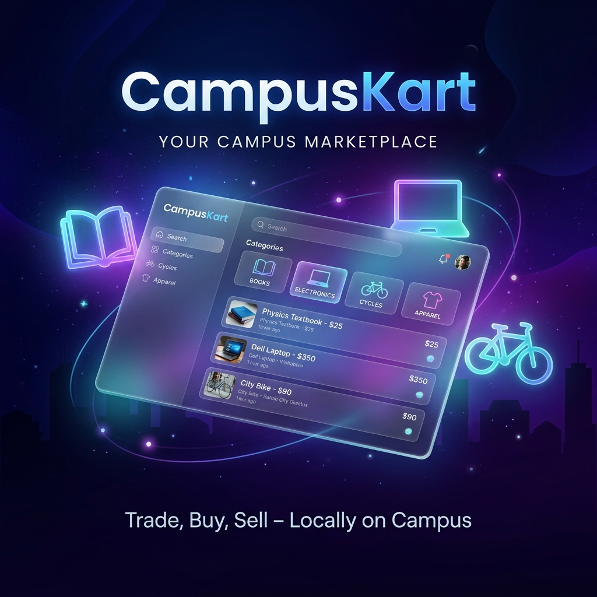

# CampusCart 🛒
### A modern MERN-stack marketplace platform designed for students to buy, sell, and manage products within a campus ecosystem.



---

## 🌟 Overview

**CampusCart** is a specialized peer-to-peer marketplace built for university environments. It enables students to securely list, browse, and trade items like textbooks, electronics, and furniture. With real-time communication and a sleek, interactive UI, CampusCart transforms campus commerce into a seamless digital experience.

## 🚀 Key Features

- **🔐 Robust Authentication**: Secure user login/signup with JWT and Google OAuth integration.
- **🛍️ Smart Marketplace**: Dynamic product listings with category filtering and advanced search.
- **💬 Real-time Messaging**: Instant communication between buyers and sellers powered by Socket.io.
- **✨ 3D Interactive UI**: Premium user experience with glassmorphism design and Framer Motion animations.
- **👤 User Dashboard**: Manage listings, view wishlists, and customize profile settings.
- **🛡️ Admin Panel**: Comprehensive moderation tools for managing users and product listings.
- **📱 Responsive Design**: Fully optimized for mobile, tablet, and desktop views.
- **⚡ Performance & SEO**: Optimized with image lazy loading, rate limiting, and dynamic meta tags.

## 🛠️ Tech Stack

### Frontend
- **React 19**: Modern UI development.
- **Vite**: Ultra-fast build tool.
- **Framer Motion**: Smooth 3D transitions and animations.
- **Socket.io-client**: Real-time updates.
- **React Router Dom**: Seamless navigation.
- **React Icons & Hot Toast**: Polished UI elements and notifications.

### Backend
- **Node.js & Express**: Scalable server architecture.
- **MongoDB & Mongoose**: Flexible NoSQL database.
- **Socket.io**: Real-time messaging backbone.
- **Cloudinary**: High-performance image storage and delivery.
- **Passport.js & JWT**: Secure authentication flow.

## 🏗️ Project Structure

```bash
CampusCart/
├── client/           # Frontend React application
│   ├── src/
│   │   ├── components/ # Reusable UI components
│   │   ├── pages/      # Main application views
│   │   ├── context/    # State management (Auth, etc.)
│   │   └── services/   # API communication
├── server/           # Backend Express API
│   ├── models/       # Database schemas
│   ├── routes/       # API endpoints
│   ├── middleware/   # Security and Auth logic
│   └── seed.js       # Database seeding script
└── README.md         # You are here!
```

## ⚙️ Local Setup

### Prerequisites
- Node.js (v18+)
- MongoDB (Atlas or Local)
- Cloudinary Account (for image uploads)

### Installation

1. **Clone the repository**
   ```bash
   git clone https://github.com/likhilchandra0909/CampusCart.git
   cd CampusCart
   ```

2. **Install Dependencies**
   ```bash
   # Install all dependencies (root, client, server)
   npm run install-all
   ```

3. **Environment Configuration**
   Create a `.env` file in the `server` directory with:
   ```env
   PORT=5000
   MONGO_URI=your_mongodb_uri
   JWT_SECRET=your_secret_key
   CLOUDINARY_CLOUD_NAME=your_name
   CLOUDINARY_API_KEY=your_key
   CLOUDINARY_API_SECRET=your_secret
   GOOGLE_CLIENT_ID=your_google_id
   ```

4. **Run the Application**
   ```bash
   # Starts both client and server concurrently
   npm run dev
   ```

---

## 🤝 Contributing
Contributions are welcome! Feel free to open an issue or submit a pull request.

## 📄 License
This project is licensed under the MIT License.

---
*Developed with ❤️ for the student community.*
